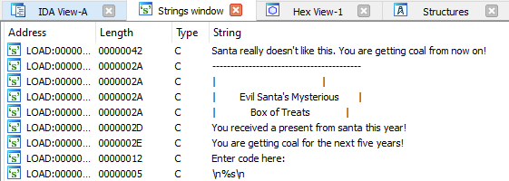
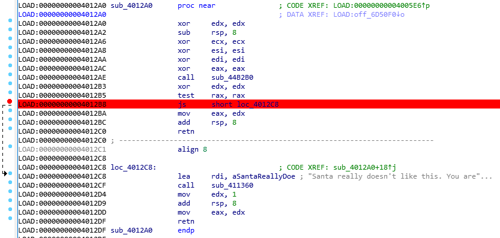
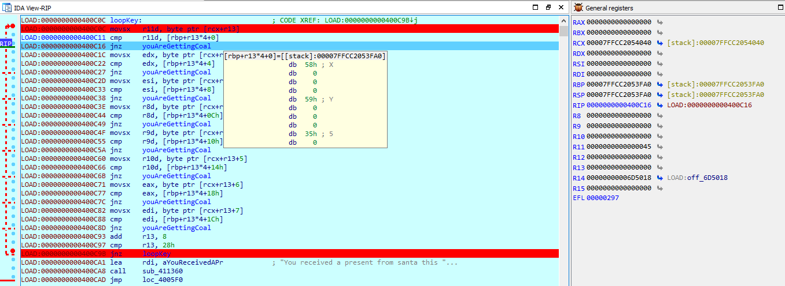

* **CTF:** UMDCTF 2020
* **Challenge:** Challenge Evil Santa's Mysterious Box of Treats
* **Category:** Rev
* **Author:** WittsEnd2
* **Solved by:** RTFM[meli0das] 


# Challenge
> 🎅 has gone 🥜!
> 
> He decided to make it impossible to get it into his 📦, and if we don't get in, we will be receiving coal for the next 💯 years!
> 
> Help us figure out how to get into the 📦 !
>
> Author: WittsEnd2


## [ 0x0 - Conhecendo o programa ]

Primeiro, verificar se realmente é um binário...

```
root@kali:~/Downloads# file EvilSantasBox 
EvilSantasBox: ELF 64-bit LSB executable, x86-64, version 1 (GNU/Linux), for GNU/Linux 3.2.0, BuildID[sha1]=e22c231ce9e73f39af223ed5d5284d20d77aeb89, statically linked, no section header
```

Identificado como ELF 64bits :)

Após executar e tentar qualquer input, obtemos o seguinte resultado.

```
root@kali:~/Downloads# ./EvilSantasBox 
-----------------------------------------
|                                       |
|                                       |
|                                       |
|         Evil Santa's Mysterious       |
|             Box of Treats             |
|                                       |
|                                       |
|                                       |
|                                       |
|                                       |
-----------------------------------------
Enter code here: 1234567890
You are getting coal for the next five years!
root@kali:~/Downloads# 
```


## [ 0x1 - Pre-debug ]

Como eu prefiro tudo nas telinhas do windows, vamos preparar para o remote debug com IDA :)

Basicamente eu...
```
1 - Copio o arquivo linux_server64 que está na pasta do IDA;
2 - Deixo na pasta onde meu ELF será debugado;
3 - Executo o ./linux_server64;
4 - Copio o ELF para o windows;
5 - Abro o ELF no IDA;
6 - Configuro o IDA para acessar o linux;
7 - Pronto, so debugar!
```

PS .: Para uma explicacao melhor (https://www.hex-rays.com/products/ida/support/freefiles/remotedbg.pdf)

Tudo configurado, let's go!

## [ 0x2 - Análise ]

Binário carregado no IDA, para ver as strigs **SHIFT+F12**.

Logo de cara vemos o que interessa :)



Adiantando um pouco as coisas, a mensagem: **Santa really doesn't like this. You are getting coal from now on!** é identificada quando a aplicação está rodando sobre um debuger, o famoso anti-debug.

Para não pular e dar essa mensagem, basta - em runtime - modificar o salto [js](https://www.aldeid.com/wiki/X86-assembly/Instructions/js) mudando a eflag [SF](https://www.aldeid.com/wiki/X86-assembly/Registers#SF_.28Sign_Flag.29)
 para **0** que segue a comparação sem executar o trecho abaixo.





Após analisar estáticamente e dinâmicamente, o tamanho que ele espera para o de código de entrada, deve ser 40(decimal). O meu código foi: **ABCDEFGHIJKLMNOPQRSTUVWXYZabcdefghijklmn**

Logo em seguida o programa printa uma informação importante na tela.

```
root@kali:~/Downloads# ./EvilSantasBox
-----------------------------------------
|                                       |
|                                       |
|                                       |
|         Evil Santa's Mysterious       |
|             Box of Treats             |
|                                       |
|                                       |
|                                       |
|                                       |
|                                       |
-----------------------------------------
Enter code here: ABCDEFGHIJKLMNOPQRSTUVWXYZabcdefghijklmn

EDGFIHKJMLONQPSRUTWVYX[Z]\edgfihkjmlonqp
```

E uma parte importante do código é onde ele compara a string printada na tela - que é o código que eu digitei com algumas modificações - com uma string em hardcode no binário, essa comparação é feita na imagem abaixo.



Na imagem acima é possível ver o registrador **r11** com o valor **0x45** que é igual a **69 decimal** e também é igual a letra **E** em ASCII, letra ao qual começa a strings gerada pelo programa - meu código digitado, porém, alterado.

Ao final dessas comparações a string que deve ser gerada é essa: **XY5IU5TKNZvV][92PX:5Q[9YZ5Ts]XThQ7]zVJ2A**


## [ 0x3 - Código e bandeira ]

Fiz alguns outros testes de input e eles foram:

```
Minha entrada:			ABCDEFGHIJKLMNOPQRSTUVWXYZabcdefghijklmn
Codigo gerado:			EDGFIHKJMLONQPSRUTWVYX[Z]\edgfihkjmlonqp

Minha entrada 2:		ABCDEFGHIJKLMNOPQRSTUVWXYZ1234567890abcd
Codigo gerado 2:		EDGFIHKJMLONQPSRUTWVYX[Z]\547698;:=2edgf

Minha entrada 3:		abcdefghijklmnopqrstuvwxyzABCDEFGHIJKLMN
Codigo gerado 3:		edgfihkjmlonqpsrutwvyx{z}|EDGFIHKJMLONQP
```

Basicamente o que entendi foi que:
- Se for **ímpar** soma 4.
- Se for **par** soma 2.

Como? Bom, além do assembly, se olharmos as entradas e código gerados acima, identificamos isso.

- A(65 decimal) + 4 = 69 decimal = **E**
- B(66 decimal) + 2 = 68 decimal = **D**
- C(67 decimal) + 4 = 71 decimal = **G**
- D(68 decimal) + 2 = 70 decimal = **F**

E assim sucessivamente...
 
Para validar, fiz esse script em python.
```
#!/bin/bash

keyCrypt="XY5IU5TKNZvV][92PX:5Q[9YZ5Ts]XThQ7]zVJ2A"
resultKey=""

for i in range(len(keyCrypt)):
    if ord(keyCrypt[i]) % 2 != 0:
        resultKey=resultKey+chr(ord(keyCrypt[i])-4)
    else:
        resultKey=resultKey+chr(ord(keyCrypt[i])-2)

print resultKey
```

Após executar o script, obtenho a string: **VU1EQ1RGLXtTYW50NV81MW5UX1RoYVRfM3YxTH0=**

Como essa strings não tem cara de flag, tentei decodar com base64, e...

```
root@kali:~# echo VU1EQ1RGLXtTYW50NV81MW5UX1RoYVRfM3YxTH0= | base64 --decode
UMDCTF-{Sant5_51nT_ThaT_3v1L}

```

Well done! ;)
